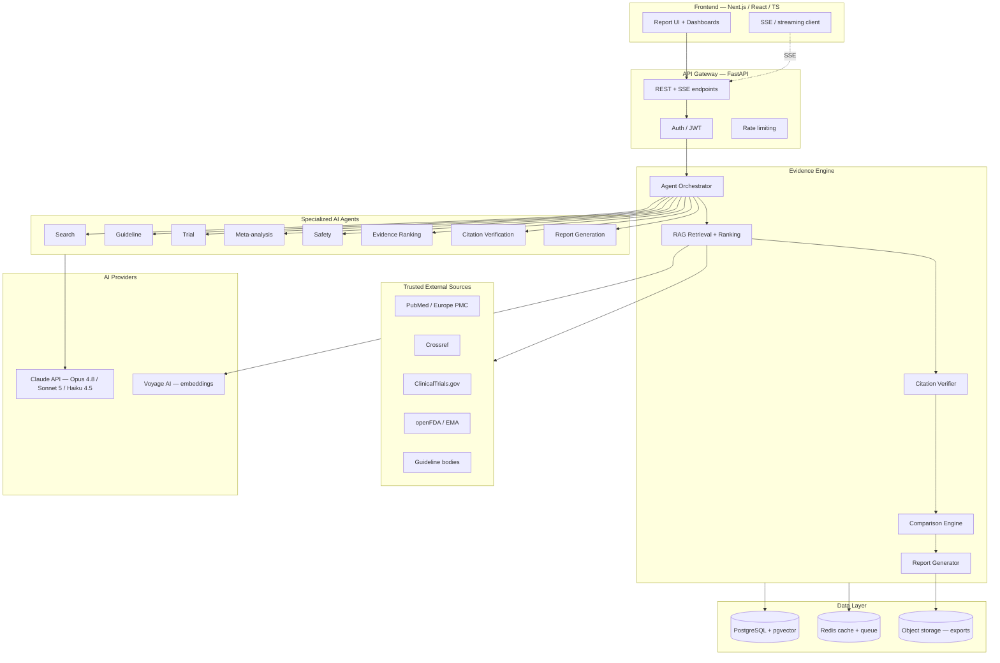
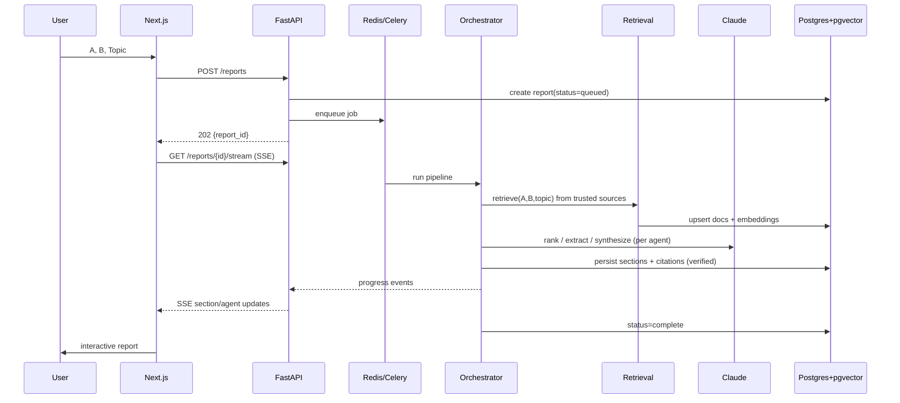

# EvidenceCompare AI — System Architecture

**Phase:** 0 (Design) · **Last updated:** 2026-07-03

---

## 1. High-level architecture

---

## 2. Request lifecycle (generate a report)

---

## 3. Component responsibilities

| Component | Responsibility |
|---|---|
| **Frontend (Next.js)** | Input form, streaming report view, dashboards, visualizations, export triggers, auth UI |
| **API Gateway (FastAPI)** | AuthN/Z, request validation, SSE streaming, rate limiting, job enqueue |
| **Orchestrator** | Runs the agent pipeline, manages state machine, emits progress events |
| **RAG Retrieval** | Query trusted APIs, normalize, dedupe, embed (Voyage), vector + keyword search |
| **Evidence Ranking** | Score by design/recency/size/relevance; GRADE-style confidence |
| **Citation Verifier** | Resolve every DOI/PMID/registry ID against source before inclusion |
| **Comparison Engine** | Build side-by-side rows with confidence scores |
| **Report Generator** | Compose sections, enforce per-claim attribution, structured output |
| **Data Layer** | Postgres (relational + pgvector), Redis (cache/queue), object storage (exports) |

---

## 4. Async processing

- Report generation is a **background job** (Celery worker, Redis broker).
- API returns `202` + `report_id`; client subscribes to **SSE** for live progress.
- Long LLM calls use **streaming** (`.stream()` / `get_final_message()`), never blocking a
  request thread past sensible timeouts.
- Idempotency: a normalized `(A, B, topic, source_snapshot)` key enables cache reuse.

---

## 5. Caching & cost strategy

- **Redis** caches: normalized drug lookups, upstream API responses (TTL per source
  license), completed report payloads.
- **Prompt caching (Claude):** stable system prompts + shared evidence context cached to
  cut input cost on multi-agent passes over the same evidence set.
- **Model tiering:** cheap extraction on Haiku 4.5, orchestration on Sonnet 5, final
  synthesis + confidence scoring on Opus 4.8 (see `06-ai-workflow.md`).

---

## 6. Trust boundary

- Only the **RAG layer** talks to external evidence sources; the allowlist is enforced there.
- The LLM never "browses" freely for citations — it only synthesizes over **retrieved,
  verified** records passed in context. This is the core anti-hallucination control.

---

## 7. Environments

- **Local:** Docker Compose (frontend, api, worker, postgres+pgvector, redis).
- **CI:** GitHub Actions (lint, type-check, unit/integration/e2e, build images).
- **Prod:** containerized backend + worker; managed Postgres w/ pgvector; managed Redis;
  frontend on Vercel or container. See `07` deployment (Phase 7).
