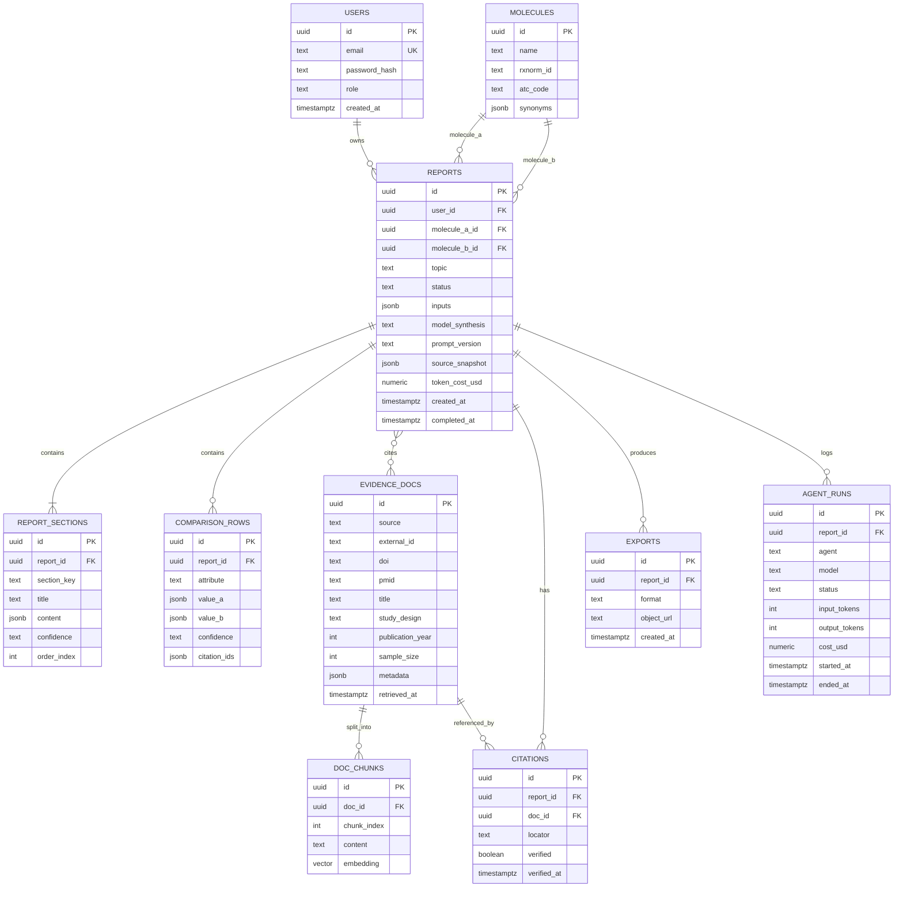

# EvidenceCompare AI — Database Schema

**Phase:** 0 (Design) · **DB:** PostgreSQL 16 + pgvector · **Last updated:** 2026-07-03

---

## 1. Entity-relationship overview



---

## 2. Key tables (DDL sketch)

```sql
CREATE EXTENSION IF NOT EXISTS vector;
CREATE EXTENSION IF NOT EXISTS pg_trgm;   -- keyword/trigram search for hybrid retrieval

CREATE TABLE users (
    id             uuid PRIMARY KEY DEFAULT gen_random_uuid(),
    email          text UNIQUE NOT NULL,
    password_hash  text NOT NULL,
    role           text NOT NULL DEFAULT 'user',   -- user | admin
    created_at     timestamptz NOT NULL DEFAULT now()
);

CREATE TABLE molecules (
    id         uuid PRIMARY KEY DEFAULT gen_random_uuid(),
    name       text NOT NULL,
    rxnorm_id  text,
    atc_code   text,
    synonyms   jsonb NOT NULL DEFAULT '[]',
    UNIQUE (name)
);

CREATE TABLE reports (
    id              uuid PRIMARY KEY DEFAULT gen_random_uuid(),
    user_id         uuid REFERENCES users(id) ON DELETE CASCADE,
    molecule_a_id   uuid REFERENCES molecules(id),
    molecule_b_id   uuid REFERENCES molecules(id),
    topic           text NOT NULL,
    status          text NOT NULL DEFAULT 'queued', -- queued|running|complete|failed
    inputs          jsonb NOT NULL DEFAULT '{}',
    model_synthesis text,                            -- e.g. claude-opus-4-8
    prompt_version  text,
    source_snapshot jsonb,                           -- retrieval params for reproducibility
    token_cost_usd  numeric(10,4) DEFAULT 0,
    created_at      timestamptz NOT NULL DEFAULT now(),
    completed_at    timestamptz
);

CREATE TABLE evidence_docs (
    id               uuid PRIMARY KEY DEFAULT gen_random_uuid(),
    source           text NOT NULL,                  -- pubmed|europepmc|crossref|ctgov|fda|guideline
    external_id      text,
    doi              text,
    pmid             text,
    title            text,
    study_design     text,                           -- rct|meta|systematic_review|guideline|...
    publication_year int,
    sample_size      int,
    metadata         jsonb NOT NULL DEFAULT '{}',
    retrieved_at     timestamptz NOT NULL DEFAULT now(),
    UNIQUE (source, external_id)
);
CREATE INDEX ON evidence_docs (doi);
CREATE INDEX ON evidence_docs (pmid);

CREATE TABLE doc_chunks (
    id          uuid PRIMARY KEY DEFAULT gen_random_uuid(),
    doc_id      uuid REFERENCES evidence_docs(id) ON DELETE CASCADE,
    chunk_index int NOT NULL,
    content     text NOT NULL,
    embedding   vector(1024)                          -- voyage-3.5 dimension
);
CREATE INDEX ON doc_chunks USING hnsw (embedding vector_cosine_ops);
CREATE INDEX ON doc_chunks USING gin (content gin_trgm_ops);

CREATE TABLE citations (
    id          uuid PRIMARY KEY DEFAULT gen_random_uuid(),
    report_id   uuid REFERENCES reports(id) ON DELETE CASCADE,
    doc_id      uuid REFERENCES evidence_docs(id),
    locator     text,                                 -- page/section/quote
    verified    boolean NOT NULL DEFAULT false,
    verified_at timestamptz
);
```

(`report_sections`, `comparison_rows`, `exports`, `agent_runs` follow the ER diagram.)

---

## 3. Design notes

- **Vectors in Postgres (pgvector, HNSW):** hybrid search combines cosine similarity on
  `doc_chunks.embedding` with trigram/keyword match on `content`.
- **Embedding dimension 1024** matches Voyage `voyage-3.5`; change the column if the
  embedding model changes (and re-embed).
- **Citation verification** is a first-class boolean gate — a report cannot surface a
  citation whose `verified` is false.
- **Reproducibility:** `reports.source_snapshot`, `model_synthesis`, and `prompt_version`
  capture exactly how a report was produced.
- **Cost accounting:** `agent_runs` records per-agent tokens and USD; `reports.token_cost_usd`
  aggregates. Pricing sourced from the model catalog (Opus 4.8 $5/$25, Sonnet 5 $3/$15,
  Haiku 4.5 $1/$5 per MTok).
- **Dedup:** `evidence_docs` unique on `(source, external_id)`; DOI/PMID indexed for cross-source dedup.
