# EvidenceCompare AI — AI Workflow & Agents

**Phase:** 0 (Design) · **Last updated:** 2026-07-03

Defines the RAG pipeline, the specialized agents, model selection, and the
anti-hallucination controls. All LLM calls use the Anthropic **Claude API**; embeddings
use **Voyage AI**.

---

## 1. Model selection

| Role | Model | ID | Price /MTok (in/out) | Notes |
|---|---|---|---|---|
| Final report synthesis, confidence scoring | Claude Opus 4.8 | `claude-opus-4-8` | $5 / $25 | Adaptive thinking, effort `high`; 1M context |
| Agent orchestration, mid-tier reasoning | Claude Sonnet 5 | `claude-sonnet-5` | $3 / $15 (intro $2 / $10 → 2026-08-31) | Most agent steps |
| Cheap extraction, classification, relevance labels | Claude Haiku 4.5 | `claude-haiku-4-5` | $1 / $5 | High-volume, low-stakes |
| Embeddings (retrieval) | Voyage `voyage-3.5` | — | Voyage pricing | 1024-dim vectors → pgvector |

**API usage rules (current models):**
- Use `thinking={"type": "adaptive"}` + `output_config={"effort": "high"}` on Opus 4.8 /
  Sonnet 5. Do **not** pass `budget_tokens`, `temperature`, `top_p` (rejected → 400).
- **Stream** synthesis calls (large `max_tokens`) and use `get_final_message()`.
- **Structured outputs** (`output_config.format`) for comparison rows / section JSON so
  the pipeline gets schema-valid data (no assistant prefills — rejected on these models).
- **Prompt caching** on the stable system prompt + shared evidence context across the
  multi-agent passes to cut input cost.

---

## 2. RAG pipeline

```mermaid
flowchart LR
    In[A, B, Topic] --> Norm[Normalize molecules<br/>RxNorm/ATC]
    Norm --> Q[Build source queries]
    Q --> Fetch[Fetch from trusted sources<br/>PubMed/EPMC/Crossref/CTgov/FDA/Guidelines]
    Fetch --> Dedup[Dedupe by DOI/PMID]
    Dedup --> Chunk[Chunk + clean]
    Chunk --> Embed[Voyage embeddings]
    Embed --> Store[(pgvector + trgm)]
    Store --> Hybrid[Hybrid search<br/>vector + keyword]
    Hybrid --> Rank[Evidence ranking + GRADE]
    Rank --> Ctx[Verified evidence context]
    Ctx --> Synth[Section synthesis]
```



- **Hybrid retrieval:** cosine similarity (HNSW) + trigram keyword match, reciprocal-rank
  fused. Keeps recall high for exact drug/trial names.
- **Chunking:** abstract/section-aware; each chunk keeps its `doc_id` for attribution.

---

## 3. Specialized agents

Each agent has a typed input/output contract, its own versioned prompt, and a model tier.

| Agent | Job | Model tier | Output |
|---|---|---|---|
| **Search** | Plan queries, retrieve candidates from trusted sources | Sonnet 5 (plan) + code/clients | ranked candidate docs |
| **Guideline** | Extract positions from ACC/AHA/ESC/KDIGO/ADA/NICE/WHO/Cochrane | Sonnet 5 | guideline statements + source |
| **Trial** | Identify & summarize RCTs (design, n, endpoints, results) | Sonnet 5 / Haiku | structured trial records |
| **Meta-analysis** | Extract pooled effects, heterogeneity, CIs | Sonnet 5 | meta summaries |
| **Safety** | Adverse events, contraindications, interactions, special pops | Sonnet 5 | safety matrix |
| **Evidence Ranking** | Score design/recency/size/relevance → GRADE confidence | Haiku (label) + rules | ranked evidence + confidence |
| **Citation Verification** | Resolve every DOI/PMID/registry ID against source | code + Haiku | `verified: true/false` per citation |
| **Report Generation** | Compose sections + comparison rows with per-claim attribution | **Opus 4.8** | final structured report |

Orchestration (Sonnet 5) fans agents out where independent (Guideline/Trial/Meta/Safety
run in parallel over the shared evidence context), then Ranking → Verification → Report.

---

## 4. Anti-hallucination controls (non-negotiable)

1. **Closed-book synthesis:** the LLM only synthesizes over **retrieved** evidence passed
   in context. It never invents citations; it cannot "browse."
2. **Citation verification gate:** every DOI/PMID/registry ID is resolved against its
   source. Unverified citations are dropped; a claim losing all citations is downgraded or removed.
3. **Per-claim attribution:** each claim in `content.claims[]` carries `citation_ids`.
   Claims with zero citations are not rendered as fact.
4. **Insufficient-evidence honesty:** when evidence is thin, the section/row is marked
   `confidence: very_low` + `insufficient_evidence: true` — never padded with invention.
5. **Confidence scoring:** GRADE-inspired (High/Moderate/Low/Very Low) from study design,
   consistency, directness, precision, and volume.
6. **Reproducibility:** model ID, prompt version, and retrieval snapshot stored per report.

---

## 5. Cost & performance controls

- Model tiering (Haiku for volume, Opus only for final synthesis).
- Prompt caching on shared evidence context across agent passes.
- Redis caching of upstream API responses and completed reports.
- Per-report token/cost accounting in `agent_runs` + `reports.token_cost_usd`.
- Streaming to the UI so the first section appears well before the full report completes.

---

## 6. Example prompt shape (Report Generation agent)

```python
resp = client.messages.create(
    model="claude-opus-4-8",
    max_tokens=16000,
    thinking={"type": "adaptive"},
    output_config={"effort": "high", "format": {"type": "json_schema", "schema": REPORT_SECTION_SCHEMA}},
    system=[{"type": "text", "text": SYSTEM_PROMPT_V1, "cache_control": {"type": "ephemeral"}}],
    messages=[{"role": "user", "content": build_evidence_context(section, verified_docs)}],
)
```
System prompt enforces: use only provided evidence; attach `citation_ids` to every claim;
emit `insufficient_evidence: true` when the evidence set does not support the section.
