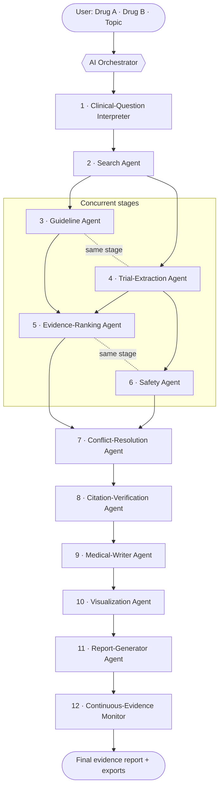
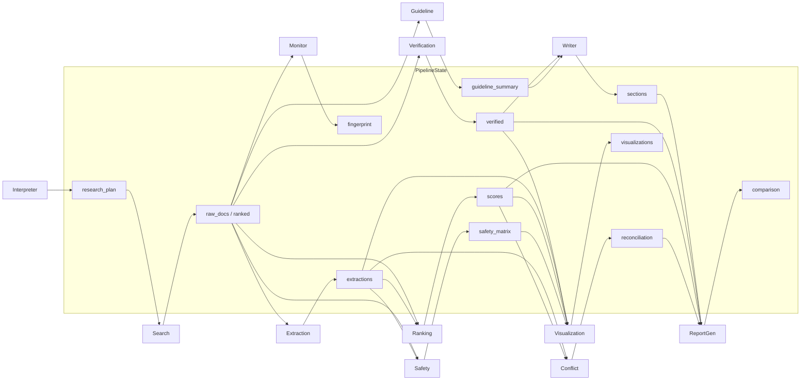
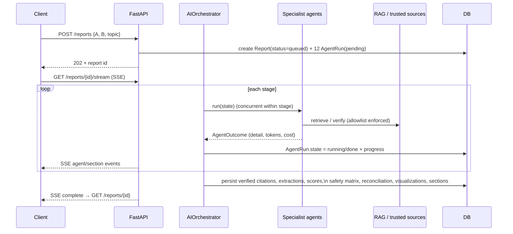

# 07 — Multi-Agent Medical Research Engine (V3)

Version 3 upgrades the single AI workflow into a **coordinated system of twelve
specialized agents** driven by a central orchestrator. Every search still executes
as one seamless request for the user; underneath, the orchestrator plans the
workflow, assigns work to specialists, collects their outputs on a shared
`PipelineState`, detects/resolves conflicts, and produces one final, fully-cited
evidence report.

The V3 engine preserves every V2 feature and the **anti-hallucination contract**:
the RAG layer is the only thing that touches external sources (trusted-source
allowlist enforced there), every citation is verified before it can appear, every
claim carries `citation_ids`, and thin evidence yields `insufficient_evidence`
instead of invention.

Code lives in `apps/api/app/agents/`; the orchestrator is
`agents/orchestrator.py`; persistence stays in `pipeline/engine.py`.

---

## Pipeline overview

The **display/rail order** is the twelve-agent spec order above. The
**execution plan** groups agents into dependency-ordered *stages*; independent
agents within a stage run concurrently (see [Concurrency](#performance--concurrency)).

## Execution stages (dependency-ordered)

| Stage | Agents (concurrent within a stage) | Reads | Writes |
|---|---|---|---|
| S1 | Interpreter | inputs | `research_plan` |
| S2 | Search | `research_plan` | `raw_docs`, `ranked`, `queries` |
| S3 | Guideline **‖** Trial-Extraction | `ranked` | `guideline_summary`, `extractions` |
| S4 | Evidence-Ranking **‖** Safety | `ranked`, `extractions` | `scores`, `safety_matrix` |
| S5 | Conflict-Resolution | `extractions`, `scores` | `reconciliation`, `conflicts` |
| S6 | Citation-Verification | `ranked` | `verified` (+ remaps upstream refs) |
| S7 | Medical-Writer | `verified`, `guideline_summary` | `sections` |
| S8 | Visualization | `verified`, `extractions`, `scores`, `safety_matrix` | `visualizations` |
| S9 | Report-Generator | `sections`, `verified`, `scores`, `reconciliation` | `sections` (ordered), `comparison`, `molecule_evidence` |
| S10 | Continuous-Evidence Monitor | `raw_docs` | `fingerprint`, `freshness` |

> **Design note.** Per the V3 spec the *Search Agent's* output is a ranked study
> list, so selection/embedding/relevance ranking lives there; the *Evidence-Ranking
> Agent* is the interpretable **scoring** stage (evidence/quality/risk-of-bias/…);
> and a dedicated *Citation-Verification Agent* is the anti-hallucination gate.

## Agent-interaction (shared state)

## Sequence (one search)

---

## The twelve agents

Every agent subclasses `agents.base.Agent`, implements `async run(state)`, returns
an `AgentOutcome` (detail + token/cost accounting), and has a **live-LLM path** plus
a **deterministic offline fallback** so the whole pipeline runs and is testable with
no network or API keys.

| # | Agent (`key`) | Responsibilities | Inputs | Outputs | Error handling |
|---|---|---|---|---|---|
| 1 | Clinical-Question Interpreter (`interpreter`) | Parse intent, build PICO, expand synonyms/disease terms/keywords | A, B, topic | `research_plan` | Live plan → offline lexicon plan on any exception |
| 2 | Search (`search`) | Optimized boolean queries; retrieve trusted sources; dedupe; embed; evidence-tier rank; select top-k; assign stable `c1..cN` | `research_plan` | `raw_docs`, `ranked`, `queries` | Live queries → offline queries; retrieval failures isolated per source in the registry |
| 3 | Guideline (`guideline`) | Summarize guideline recommendations; attribute per molecule | `ranked` (guidelines) | `guideline_summary` | Live summary → offline characterization |
| 4 | Trial-Extraction (`extraction`) | Structured per-study fields (design, population, HR/RR/CI/p, AEs, limitations) | `ranked` (trial-like) | `extractions` | Live extraction → offline regex parse; invented `ref_key`s dropped |
| 5 | Evidence-Ranking (`ranking`) | Evidence/quality/risk-of-bias/confidence/publication/consistency scores + 9-tier hierarchy | `ranked`, `extractions` | `scores` | Deterministic (no external call) |
| 6 | Safety (`safety`) | Comparative safety matrix across 10 domains (contraindications … adverse events) | `ranked`, `extractions` | `safety_matrix` | Deterministic; unaddressed domains reported honestly |
| 7 | Conflict-Resolution (`conflict`) | Detect opposing significant effects; explain heterogeneity axes | `extractions`, `scores` | `reconciliation`, `conflicts` | Deterministic; never invents a conflict the numbers don't show |
| 8 | Citation-Verification (`verification`) | Resolve every citation (DOI/PMID/registry); prune broken; re-key `c1..cN`; remap upstream refs | `ranked` | `verified`, `verification` | Offline treats trusted records as resolved (identity remap) |
| 9 | Medical-Writer (`writer`) | Clinician-facing narrative sections closed-book over verified evidence | `verified`, `guideline_summary` | `sections` | Live Opus synthesis → offline extractive; invented-citation sanitizer |
| 10 | Visualization (`visualization`) | Precompute chart payloads (timeline, pyramid, forest, heatmap, network, matrices, meter) | `verified`, `extractions`, `scores`, `safety_matrix` | `visualizations` | Deterministic reshape only |
| 11 | Report-Generator (`report`) | Assemble canonical section order; build comparison + molecule matrix; derive Evidence-Ranking / Research-Gaps sections | `sections`, `verified`, `scores`, `reconciliation` | `sections`, `comparison`, `molecule_evidence` | Deterministic |
| 12 | Continuous-Evidence Monitor (`monitor`) | Baseline living-evidence fingerprint; declare watched signal types | `raw_docs` | `fingerprint`, `freshness` | Deterministic; ongoing sweep in `services.freshness_service` |

**Orchestrator-level error isolation.** `AIOrchestrator._run_agent` wraps every
agent call: an exception is logged, converted to an `AgentOutcome(detail="error: …")`,
recorded in the execution log with `state="error"`, surfaced on the agent rail, and
the pipeline continues with graceful degradation rather than failing the whole report.

---

## Transparency Mode

The orchestrator records, per agent: a structured execution log
(`agent_logs`) — agent, model, detail, tokens, cost, and processing time — plus a
per-agent timing map (`agent_timings`) and a run snapshot (`source_snapshot`:
queries executed, candidate/ranked/verified counts, research plan). These are
exposed under `ReportOut.research_process` and rendered by the optional
**Research Process** panel in the web UI (`components/report/research-process-panel.tsx`),
which is **hidden by default** and shows: queries executed, databases searched,
studies found/excluded, ranking decisions, evidence confidence, verification
results, the safety matrix, conflict reconciliation, and processing time.

## Performance & concurrency

- **Concurrency.** Independent agents within a stage run via `asyncio.gather`
  (S3: Guideline ‖ Extraction; S4: Ranking ‖ Safety). Agents never touch the DB —
  only the orchestrator's progress callback does, and it emits sequentially — so
  concurrency is safe against the single async DB session.
- **Caching.** Complete reports are reused for the same normalized query within
  `REPORT_CACHE_TTL_HOURS` (see `services.report_service`); embeddings and retrieval
  are computed once per run.
- **Graceful fallback.** Every agent degrades to a deterministic offline path; the
  trusted-source registry isolates a temporarily-unavailable source without failing
  the run.

## Backward compatibility

All V3 artifacts are **additive, nullable** columns
(`5d8f4e0b2c34_add_v3_multi_agent_artifacts`): `research_plan`, `evidence_scores`,
`safety_matrix`, `reconciliation`, `visualizations`, `verification`, `agent_logs`,
`agent_timings`. Legacy V2 reports render unchanged (the fields are simply absent),
and the offline engine remains deterministic — the full 12-agent chain runs with no
keys, which is what the test suite exercises.

## Extensibility

The engine is a list of stages of agents (`orchestrator.DEFAULT_PLAN`). Future work
plugs in as new agents/stages without touching existing ones: patient-specific
decision support (a context agent feeding the Writer), multilingual output (a
post-Writer translation agent), and licensed knowledge sources (new `EvidenceSource`
implementations behind the allowlist).
